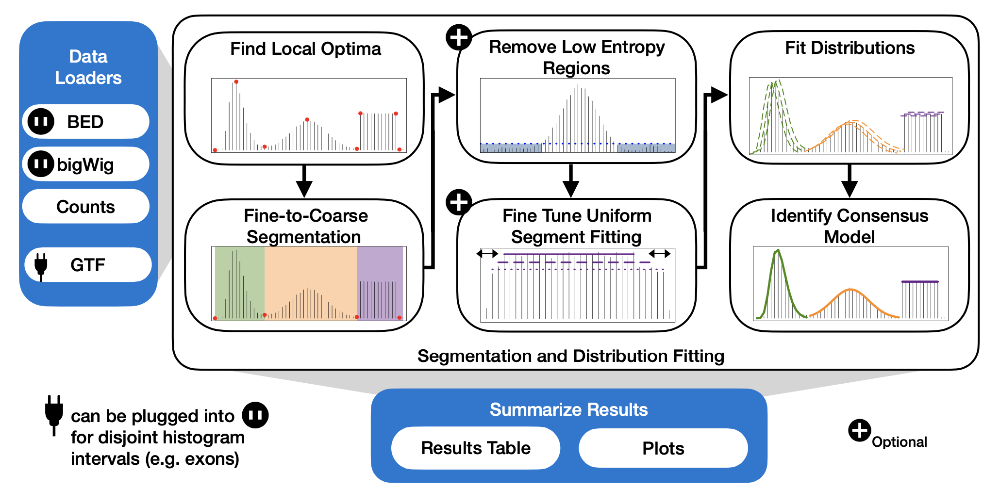
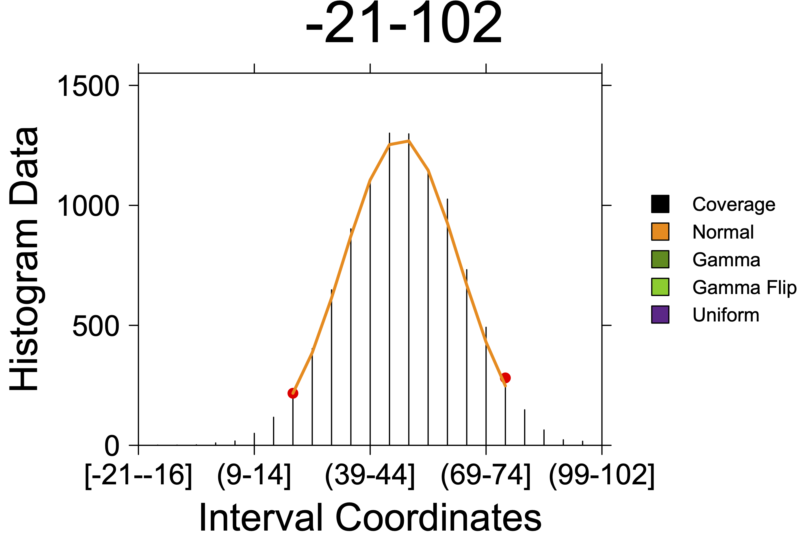

# HistogramZoo

1. [Description](#description)
2. [Installation](#installation)
3. [Quick start](#quick-start)
4. [Resources](#resources)
5. [Getting help](#getting-help)
6. [Citation information](#citation-information)
7. [License](#license)

## Description
HistogramZoo is a generalized framework for histogram segmentation and statistical characterization written in R. Histograms are represented as S3 Histogram or GenomicHistogram objects. For the characterization of genomic data on a linear coordinate system, such as the human reference genome, HistogramZoo provides several convenient data loaders to compute coverage of BED files and load bigWig files, and support both genomic and transcriptomic coordinate systems.

The characteristic function provided by HistogramZoo is `segment_and_fit` which is a wrapper for a sequence of operations which aim to segment complicated histograms and identify regions of enriched density and fit known statistical distributions to these regions. Using the Fine-to-Coarse segmentation algorithm described in [Delon *et al.,* 2006](https://link.springer.com/chapter/10.1007/11492542_30), segmentation occurs iteratively on a set of local optima. The user is provided with the option of filtering low entropy regions, fitting truncated distributions, fine-tuning the endpoints of uniformly-distributed regions and using several goodness-of-fit metrics to improve reported results.

Finally, HistogramZoo provides several convenient functions to summarize fits and visualize data.



## Installation

Using devtools in R:
```R
library(devtools);
install_github('https://github.com/uclahs-cds/public-R-HistogramZoo');
```

From source:
```shell
git clone https://github.com/uclahs-cds/public-R-HistogramZoo.git
R CMD INSTALL public-R-HistogramZoo
```

From CRAN (coming soon!)

## Quick start

A basic example of applying HistogramZoo to a histogram of Gaussian data is provided below:

```R

library(HistogramZoo);

set.seed(271828);

# Generating Data
gaussian_data <- rnorm(10000, mean = 50, sd = 15);
histogram_data <- observations_to_histogram(gaussian_data, histogram_bin_width=5);

# Segmentation and fitting distributions
results <- segment_and_fit(histogram_data, eps = 1);

# Summarizing results
results_table <- summarize_results(results);

# Plotting
create_coverageplot(results);

```

**Results table**

| region_id | segment_id | start | end | interval_count | interval_sizes | interval_starts | histogram_start | histogram_end | value        | metric    | dist | dist_param1 | dist_param2 | dist_param1_name | dist_param2_name |
|-----------|------------|-------|-----|----------------|----------------|-----------------|-----------------|---------------|--------------|-----------|------|-------------|-------------|------------------|------------------|
| -21-102   |          1 |    19 |  79 |              1 | 61,            | 1,              |               9 |            20 | 0.9554924687 | consensus | norm | 33.03241096 | 14.88105209 | mean             | sd               |

**Coverage plot**


## Resources

- [Function reference](https://uclahs-cds.github.io/public-R-HistogramZoo/reference/index.html)
- [Vignette](https://uclahs-cds.github.io/public-R-HistogramZoo/articles/HistogramZoo.html)

## Getting help

Looking for guidance or support with HistogramZoo? Look no further.

* Check out our [Discussions](https://github.com/uclahs-cds/public-R-HistogramZoo/discussions) page!
* Submit bugs :bug:, suggest new features :cherry_blossom: or see current work :mechanical_arm: at our [Issues](https://github.com/uclahs-cds/public-R-HistogramZoo/issues) page.

## Citation information

You have stumbled upon an unpublished software :shushing_face: :shushing_face: :shushing_face:. We are currently preparing the manuscript for HistogramZoo. Please befriend us to learn more or check back later for updated citation information.

## License

Authors: Helen Zhu, Stefan Eng, Paul C. Boutros (PBoutros@mednet.ucla.edu)

HistogramZoo is licensed under the GNU General Public License version 3.0. See the file LICENSE.md for the terms of the GNU GPL license.

HistogramZoo is a generalized framework for histogram segmentation and statistical characterization written in R.

Copyright (C) University of California Los Angeles ("Boutros Lab") All rights reserved.

This program is free software; you can redistribute it and/or modify it under the terms of the GNU General Public License as published by the Free Software Foundation; either version 3 of the License, or (at your option) any later version.

This program is distributed in the hope that it will be useful, but WITHOUT ANY WARRANTY; without even the implied warranty of MERCHANTABILITY or FITNESS FOR A PARTICULAR PURPOSE. See the GNU General Public License for more details.
