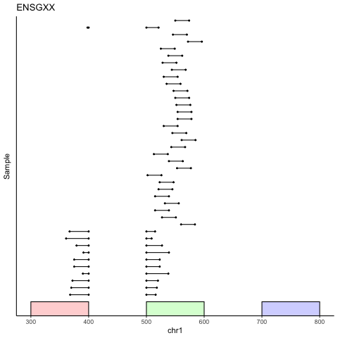
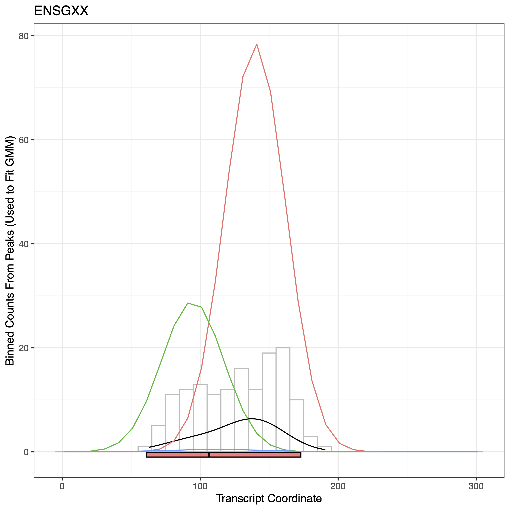

```{r setup, include=FALSE}
knitr::opts_chunk$set(echo = TRUE, warning=FALSE, message=FALSE, width=500, eval=FALSE)
options(max.print=35)

library(ConsensusPeaks)
```

# Introduction
A common step in the bioinformatic analysis of epigenetic pulldown experiments such as ChIP-seq, ATAC-seq, MeRIP-seq, CLIP-seq and other methods is to call peaks across biological replicates. In such studies, it is often desirable to identify a set of common peaks between replicates, count reads and conduct differential analysis. It is easy to identify common peaks with few replicates by simply taking the union of the set of peak regions. However, as datasets grow, the length of peak unions also grow, spanning the finite space defined by the genome or transcriptome. Additionally, epitranscriptomic pulldown experiments are growing in popularity. While peak callers for the transcriptome (e.g. exomePeak, MeTPeak) have been created, there is no available tool to identify overlapping peaks that span multiple exons. ConsensusPeaks is a tool that implements several models described in the literature to identify a consensus set of regions for RNA pulldown experiments.

# Methods


### Segment & Fit
Segment and Fit is a method that takes the union of the peaks and looks for local optima to segment the peaks into finer regions. Each of these regions is fit with a continuous distribution to characterize its shape.

### The Union Method
We included a method that returns the union of peaks.

# Example

## Simulating Peaks from Gaussians

To start, we wrote a function called `simulate.gaussian.peaks` to simulate peaks using Gaussian distributions on RNA transcripts. To simulate peaks, the user is required to provide the following for each Gaussian:

1) `MU` is a vector of means given in transcriptomic coordinates.

2) `SD` is a vector of standard deviations.

3) `EXTEND.WIDTH` is the desired length of peaks in bps.

4) `NSAMPLES` is the number of samples where each sample generates each peak (so in other words, the number of peaks).

Using a GTF file provided by the user, the user needs to indicate:

5) `GTF` is the path to the GTF (Yes, we made a toy one that is included in the package, feel free to borrow it!)

6) `GENE` is the gene_id of the gene on which to simulate peaks. This gene must be found in the GTF file.

For reproducibility, we also included a seed.

7) `SEED` for reproducibility.

The output of this function is a BED12 file (read [here](https://genome.ucsc.edu/FAQ/FAQformat.html#format1) for details) with an extra column `sample` indicating sample id's of biological replicates. This format fits nicely with downstream functions as a `PEAKS` data frame.

```{r peak_simulation}

# Loading a toy GTF File
data.path = system.file("extdata", package = "ConsensusPeaks")
gtf = paste0(data.path, "/test.gtf")

# Simulating Peaks
ensgxx = simulate.gaussian.peaks(
  MU = c(100, 150),
  SD = c(10, 20),
  EXTEND.WIDTH = c(50, 25),
  NSAMPLES = c(10, 30),
  GENE = "ENSGXX",
  GTF = gtf,
  SEED = 123)

head(ensgxx)

```

## Visualizing Peaks across a Gene

If you are anything like us, you would want to know what this looks like. Thus, we wrote a function to visualize peaks in a genomic coordinate system.

1) `GENE` is the gene_id.

2) `PEAKS` is the set of peaks called in a BED12 format with an extra column indicating sample id.

3) `GTF` is the path to the GTF file.

4) `OUTPUTDIR` is the output directory.

5) `OUTPUT.TAG` is the character string attached to the output file.

6) `PLOT` is a logical indicator which if `TRUE` will create a plot in PDF format in the output directory. Otherwise, if `FALSE`, it will only return the ggplot object.

```{r genomic_peak_visualization}

# Loading Peaks
peaks.file = paste0(data.path, "/peaks.bed")

peaks = read.table(
  peaks.file,
  header = F,
  sep = "\t",
  stringsAsFactors = F)

colnames(peaks) = c("chr", "start", "end", "name", "score", "strand", "thickStart", "thickEnd",
                    "itemRGB", "blockCount", "blockSizes", "blockStarts", "sample")

# Plotting Peaks
p = plot.gene.peaks(
  GENE = "ENSGXX",
  PEAKS = peaks,
  GTF = gtf,
  OUTPUTDIR = ".",
  OUTPUT.TAG = "",
  PLOT = F
)

```


The black lines show the peaks called in each sample. The colourful rectangles at the bottom indicate gene exons. Since the peak file we are using in this example was generated by the simulation above, we can see there are roughly two sets of peaks in this diagram, set of longer peaks at the bottom corresponding to the first Gaussian (mu = 100, sd = 10, peak width = 50, samples = 10) and the set of shorter peaks at the top corresponding to the second Gaussian (mu = 150, sd = 20, peak width = 25, samples = 20).

```{r genomepeaks, echo=FALSE, fig.cap="Peaks in a genomic coordinate system", out.width = '60%'}

```

## Identify Consensus Peaks using a GMM with a Dirichlet Process Prior

We wrote a function to fit a GMM with a Dirichlet Process prior on the pileup of peaks. The following parameters are required:

1) `GENES` A character vector of gene_id's to be tested.

2) `PEAKS` A data frame containing the following columns, and potentially extras, usually found in a BED12 file, base 0 system. An addition column `sample` is required to indicate sample id of the biological replicates.

* `chr` chromosomes, character, same format as those identified in GTF file

* `start` starting position of the peak, integer. base 0

* `end` end position of the peak, integer, base 0

* `name` gene id, character

* `score` p-value associated with the peak

* `strand` strand of the gene, only +, -, * are accepted

* `blockCount` number of segments in the peak, integer

* `blockSizes` size of segments in the peak, BED12 notation, comma-separated

* `blockStarts` starting positions of segments, BED12 notation, comma-separated

* `sample` sample_id of samples, character

3) `RNA.OR.DNA` One of 'rna' or 'dna' indicating whether peaks are identified on the transcriptome or genome.

4) `METHOD` One 'dpc', 'union', 'corces' indicating the method used to merge peaks.

5) `GTF` The path to a GTF file, character string.

6) `PLOT.MERGED.PEAKS` Either a logical value (TRUE or FALSE) indicating all or none of the merged peaks should be plotted. Otherwise, a character vector of genes whose merged peaks should be plotted.

7) `OUTPUT.TAG` A character string added to the names of any output files.

8) `OUTPUTDIR` Output directory. If the directory does not exist, ConsensusPeaks will attempt to create the directory.

9) `WRITE.OUTPUT` A logical value indicating whether the output table should be written. Otherwise, it is returned.

```{r dp_consensus_peaks, message = F}

results = ConsensusPeaks(
 GENES = c("ENSGXX", "ENSGYY"),
 PEAKS = peaks,
 RNA.OR.DNA = "rna",
 METHOD = "sf",
 GTF = gtf,
 DP.RESOLUTION = 10,
 DP.ITERATIONS = 1000,
 DP.WEIGHT.THRESHOLD = 0.1,
 DP.N.SD = 1.5,
 DP.ALPHA.PRIORS = c(0.5,5),
 DP.SEED = 123,
 PLOT.MERGED.PEAKS = F,
 OUTPUT.TAG = "TEST",
 OUTPUTDIR = ".",
 WRITE.OUTPUT = F
)

head(results[,1:13])
```

Below are the results from the ENSGXX gene using the peaks we simulated earlier. On the left, the plot shows a histogram of counts sampled at `DP.RESOLUTION` base pairs in grey. This is the distribution of data observed by GMM. The black line indicates the fitted GMM. The colored lines show the individual Gaussians fitted, scaled by weight. The colored rectangles at the bottom show the retrieved peaks. On the right, the plot shows a bp resolution coverage of pileup of peaks in grey. This plot is used to diagnose issues with sampling at an unsuitable resolution.

From these plots, we can see that using a GMM model with a Dirichlet Process prior does a reasonable job of recovering the distributions from which these peaks were drawn. The means of the two Gaussians are approximately at 80 bps and 130 bps with the peak on the right weighted approximately 3x the peak on the left (we drew 10 samples from the Gaussian(100, 10) and 30 samples from the Gaussian(150, 20)).

```{r transcriptomepeaks, echo=FALSE, out.width = '45%'}

knitr::include_graphics("ENSGXX.MergedPeaks.bp.png")
```

## P values
Currently, p values per sample in the output file results from merging p values of peaks that overlap with the resulting peak using [Fisher's Method]().
