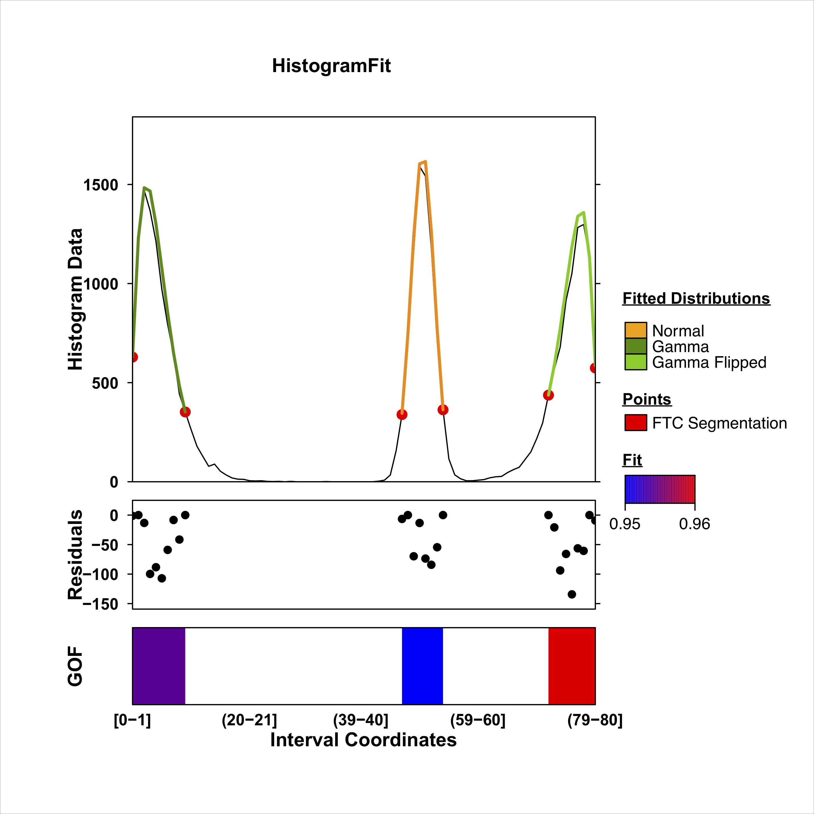

```{r setup, include=FALSE}
knitr::opts_chunk$set(echo = TRUE, warning=FALSE, message=FALSE, width=500)
options(max.print=35)

library(HistogramZoo)
library(BoutrosLab.plotting.general)

```

# Introduction
The HistogramZoo R package is a collection of functions which aim to identify and characterize patterns from histogram data.

# The Histogram and GenomicHistogram class

A **Histogram** object contains 1 piece of essential data and 4 pieces of optional data:

* **histogram_data** is a numeric vector representing histogram data. In cases of equal bin width, `histogram_data` can equally represent counts or density with no functional differences. However, in cases of unequal bin width, only density is appropriate for distribution fitting and visualization.

* **interval_start** and **histogram_end** are numeric vectors representing the start and end coordinates of each bin

* **bin_width** is the numeric length of bins. This can be automatically estimated from `interval_start` and `interval_end`. Objects are required to have equal bin width for every bin with the exception of the last bin, which can have a shorter bin width.

* **region_id** is a character id for the histogram

A **GenomicHistogram** object contains up to 6 additional pieces of data.

* **chr** is a character chromosome

* **strand** is a character strand which is restricted to one of `+`, `-` and `*` 

* **intron_start** and **intron_end** are numeric vectors representing intron coordinates - these can be automatically computed based on non-consecutive `interval_start` and `interval_end` indices

* **consecutive_start** and **consecutive_end** are numeric vectors representing a continuous intronless bin coordinate system on which summary statistics can be computed and distributions can be fitted. Optionally specified by the user, `consecutive_start/end` will be automatically generated based on provided `interval_start/end` and `intron` data starting at base 1. 

A Histogram and a GenomicHistogram differ in several ways:

1. Conceptualization of bins: `Histogram` objects represent conventional histograms where data are binned on a real number scale. Starts are closed while ends are open with the exception of the last bin where both start and end are closed. `GenomicHistogram` objects were designed to represent a discrete [base 1](https://www.biostars.org/p/84686/) system where each histogram bin represents a set of indices on which observations are collected.

2. Only `GenomicHistogram` objects support the use of disjoint intervals, or non-consecutive bins. This feature was designed with `GenomicHistogram` objects in mind to support the representation of transcripts and genes as a set of exons which might not be consecutive intervals on the genomic coordinate system. Summary statistics and distributions are fit on `consecutive_start/end` coordinates for GenomicHistograms. In operational cases using consecutive bins, `consecutive_start/end` can be specified to be the same as `interval_start/end`.


```{r Histogram_example, include=TRUE, fig.show="hold", out.width="40%"}

my_histogram <- Histogram(
  histogram_data = c(1,2,3,1,5,6),
  interval_start = c(0,1,2,3,4,5),
  interval_end = c(1,2,3,4,5,6),
  bin_width = 1,
  region_id = "my_histogram"
)

create_coverageplot(
  my_histogram,
  main.cex = 1,
  xaxis.tck = 0, 
  yaxis.tck = 0, 
  xlab.cex = 1, 
  ylab.cex = 1, 
  xaxis.cex = 0.8, 
  yaxis.cex = 0.8,
  xat = generate_xlabels(my_histogram, n_labels = length(my_histogram), return_xat = T), 
  xaxis.lab = generate_xlabels(my_histogram, n_labels = length(my_histogram)), 
)

my_genomic_histogram <- GenomicHistogram(
  histogram_data = c(4,5,2,3,6,8),
  interval_start = c(1:3, 5:7),
  interval_end = c(1:3, 5:7),
  bin_width = 1,
  region_id = "my_genomic_histogram",
  chr = "chr1",
  strand = "*",
  intron_start = c(4),
  intron_end = c(4),
  consecutive_start = seq(6),
  consecutive_end = seq(6)
)

create_coverageplot(
  my_genomic_histogram,
  main.cex = 1,
  xaxis.tck = 0, 
  yaxis.tck = 0, 
  xlab.cex = 1, 
  ylab.cex = 1, 
  xaxis.cex = 0.8, 
  yaxis.cex = 0.8,
  xat = generate_xlabels(my_genomic_histogram, n_labels = length(my_genomic_histogram), return_xat = T), 
  xaxis.lab = generate_xlabels(my_genomic_histogram, n_labels = length(my_genomic_histogram)), 
)


```

## Estimation of summary statistics

Built-in functions can be used to estimate summary statistics, including a weighted mean, variance, standard deviation and skew, on each Histogram object.

```{r summary_statistics, include=TRUE, fig.show="hold", out.width="100%"}

histogram_summary <- data.frame(
  "id" = "my_histogram",
  "mean" = weighted.mean(my_histogram),
  "var" = weighted.var(my_histogram),
  "sd" = weighted.sd(my_histogram),
  "skew" = weighted.skewness(my_histogram)
)

genomic_histogram_summary <- data.frame(
  "id" = "my_genomic_histogram",
  "mean" = weighted.mean(my_genomic_histogram),
  "var" = weighted.var(my_genomic_histogram),
  "sd" = weighted.sd(my_genomic_histogram),
  "skew" = weighted.skewness(my_genomic_histogram)

)

knitr::kable(
  rbind(histogram_summary, genomic_histogram_summary)
)
```

# Data loaders

## Data loaders for `Histogram` objects

**observations_to_histogram** bins a set of observations at a designated `histogram_bin_width` to generate a `Histogram`

```{r observations_to_histogram, include=TRUE, out.width="50%"}
set.seed(314)
my_data <- rnorm(10000, mean = 10, sd = 5)
my_histogram <- observations_to_histogram(my_data, histogram_bin_width = 1)

create_coverageplot(
  my_histogram, 
  main.cex = NULL, 
  xaxis.tck = 0, 
  yaxis.tck = 0, 
  xlab.cex = 1, 
  ylab.cex = 1, 
  xaxis.cex = 0.8, 
  yaxis.cex = 0.8
)

```

## Data loaders for `GenomicHistogram` objects

**bigWig_to_histogram** bins the coverage from a single bigWig file on a set of user-defined regions (provided as a GRanges object, a GRangesList* object or a GTF file) and returns a list of GenomicHistogram objects. 

```{r bigWig_to_histogram, include=TRUE, out.width="50%"}

library(GenomicRanges)

filename <- system.file("extdata", "bigwigs",  "S1.bw", package = "HistogramZoo")

regions <- GenomicRanges::GRanges(
  seqnames = "chr1",
  IRanges::IRanges(
    start = c(17950, 19350),
    end = c(18000, 19600)),
  strand = "*"
)

bigwig_histograms <- bigWig_to_histogram(
  filename = filename,
  regions = regions,
  histogram_bin_size = 10
)

```

**genome_BED_to_histogram** bins the coverage from a set of genomic BED files and returns a list of GenomicHistogram objects. Users have the option of providing a set of regions as a GRanges or GRangesList* object.

```{r genome_BED_to_histogram, include=TRUE, out.width="50%"}

datadir <- system.file("extdata", "dna_bedfiles",  package = "HistogramZoo")
genome_bed_files <- list.files(datadir, pattern = ".bed$")
genome_bed_files <- file.path(datadir, genome_bed_files)

genome_bed_histograms <- genome_BED_to_histogram(
  filenames = genome_bed_files,
  n_fields = 6,
  histogram_bin_size = 1
)

```

**transcript_BED_to_histogram**, to account for overlapping transcript annotations, bins the coverage on a set of BED files where each element can be pre-assigned to a region using the 4th column (name) of the BED file. 

```{r transcript_BED_to_histogram, include=TRUE, out.width="50%"}

datadir <- system.file("extdata", "rna_bedfiles", package = "HistogramZoo")
transcript_bed_files <- file.path(datadir, paste0("Sample.", 1:20, ".bed"))
gtf <- system.file("extdata", "genes.gtf", package = "HistogramZoo")

histograms <- transcript_BED_to_histogram(
  filenames = transcript_bed_files,
  n_fields = 12,
  gtf = gtf,
  gene_or_transcript = "gene",
  histogram_bin_size = 10
)

```

### Notes on common parameters

* **regions** `[bigWig, genomic BED]`: Using a GRangesList object allows the assignment of disjoint intervals to a GenomicHistogram (e.g. representing a set of exons that can be joined to form a mature transcript) where each GRanges object in the GRangesList represents the elements of a single Histogram. Using a GRanges object creates a separate GenomicHistogram for each element in the GRanges object.

* **histogram_bin_size** `[bigWig, genomic and transcriptomic BED]`: Bins are generated using `GenomicRanges::tile` and coverage is calculated using `GenomicRanges::binnedAverage`. This strategy strives to create bins of equal size less than or equal to the designated `histogram_bin_size` (see above for discussion of the difference in `bin_width` restriction.)

* **allow_overlapping_segments_per_sample** `[transcriptomic and genomic BED]`: Each BED file is assumed to contain the elements of a single experimental sample. Thus, overlapping elements in each BED file can be eliminated by setting the parameter to `FALSE`.

# Segmentation and distribution fitting

The function **segment_and_fit** is designed to be a pipeline constructed from the following sub-functions which enables the segmentation, denoising and fitting of statistical distributions on Histogram and GenomicHistogram objects. Each of the parameters in `segment_and_fit` have counterparts in the sub-functions which is explored in further detail below.

**NOTA BENE:** Most of the functions below are implemented as S3 methods which can take `Histogram`, `GenomicHistogram` and `numeric` vector objects as input.

## Finding local optima

**find_local_optima** identifies the local minima and maxima on a vector of counts (histogram data).

```{r find_local_optima_basic, include=TRUE, out.width="50%"}

# Generating a Histogram 
set.seed(314)
dt = rnorm(10000, mean = 20, sd = 10)
xhist = observations_to_histogram(dt, histogram_bin_width = 2)

# basic use
optima = find_local_optima(xhist)
optima = sort(unlist(optima))

create_coverageplot(
  xhist, 
  add.points = T, 
  points.x = optima, 
  points.y = xhist$histogram_data[optima], 
  points.col = "red",
  main = "basic optima",
  main.cex = 1, 
  xaxis.tck = 0, 
  yaxis.tck = 0, 
  xlab.cex = 1, 
  ylab.cex = 1, 
  xaxis.cex = 0.8, 
  yaxis.cex = 0.8
)

```

The parameter `threshold` allows the user to tune the sparsity of local optima to histograms with potentially noisy counts, i.e. by thresholding the difference between neighbouring optima.

```{r find_local_optima_threshold, include=TRUE, fig.show="hold", out.width="40%"}

# Generating a Histogram with noisy counts
set.seed(314)
dt = rnorm(1000, mean = 20, sd = 10)
xhist = observations_to_histogram(dt, histogram_bin_width = 1)

# find_local_optima with threshold 0
zero_threshold_optima = find_local_optima(xhist, threshold = 0)
zero_threshold_optima = sort(unlist(zero_threshold_optima))

create_coverageplot(
  xhist,
  add.points = T, 
  points.x = zero_threshold_optima,
  points.y = xhist$histogram_data[zero_threshold_optima],
  points.col = "red", 
  type = "h",
  main = "threshold = 0",
  main.cex = 1, 
  xaxis.tck = 0, 
  yaxis.tck = 0, 
  xlab.cex = 1, 
  ylab.cex = 1, 
  xaxis.cex = 0.8, 
  yaxis.cex = 0.8
)

# find_local_optima with threshold 2
threshold_optima = find_local_optima(xhist, threshold = 2)
threshold_optima = sort(unlist(threshold_optima))

create_coverageplot(
  xhist, 
  add.points = T, 
  points.x = threshold_optima, 
  points.y = xhist$histogram_data[threshold_optima], 
  points.col = "red", 
  type = "h",
  main = "threshold = 2",
  main.cex = 1, 
  xaxis.tck = 0, 
  yaxis.tck = 0, 
  xlab.cex = 1, 
  ylab.cex = 1, 
  xaxis.cex = 0.8, 
  yaxis.cex = 0.8
)


```


The parameter `flat_endpoints` allows the user to better fit histograms with stretches of equal values (e.g. pile-ups of BED files in a GenomicHistogram). Setting the parameter to `TRUE` will allow the user to return both endpoints of a flat region while setting the parameter to `FALSE` will return the estimated midpoint of a flat region.

```{r find_local_optima_stepfunction, include=TRUE, fig.show="hold", out.width="40%"}

# Generating a Histogram with consecutive equal values
data = c(rep(1, 3), rep(2, 4), rep(3, 3), rep(2, 1), rep(1, 5))
xhist = Histogram(histogram_data = data)

# flat_endpoints
optima_flat = find_local_optima(xhist, flat_endpoints = TRUE)
optima_flat = sort(unlist(optima_flat))

create_coverageplot(
  xhist, 
  add.points = T, 
  points.x = optima_flat, 
  points.y = xhist$histogram_data[optima_flat], 
  points.col = "red",
  main = "flat endpoints",
  main.cex = 1, 
  xaxis.tck = 0, 
  yaxis.tck = 0, 
  xlab.cex = 1, 
  ylab.cex = 1, 
  xaxis.cex = 0.8, 
  yaxis.cex = 0.8
)

# midpoints
optima_midpoints = find_local_optima(xhist, flat_endpoints = FALSE)
optima_midpoints = sort(unlist(optima_midpoints))

create_coverageplot(
  xhist, 
  add.points = T, 
  points.x = optima_midpoints, 
  points.y = xhist$histogram_data[optima_midpoints], 
  points.col = "red",
  main = "midpoints",
  main.cex = 1, 
  xaxis.tck = 0, 
  yaxis.tck = 0, 
  xlab.cex = 1, 
  ylab.cex = 1, 
  xaxis.cex = 0.8, 
  yaxis.cex = 0.8
)

```

## The Fine-to-Coarse segmentation algorithm

The Fine-to-Coarse segmentation algorithm was described in @delon2005color, @lisani2021automatic and @delon2006nonparametric. Briefly, for a given histogram and a set of local optima, the FTC algorithm iterates through consecutive segments identifying _peaks_, segments of increasing counts followed by segments of decreasing counts. Consecutive segments are merged based on the prioritization derived from a monotone cost function, until an optimal set of peaks are acquired. Granularity of the optimal peak set can be tuned via the hyperparamter $\epsilon$. 

```{r ftc_epsilon, include=TRUE, fig.show="hold", out.width="40%"}

# Generating a Histogram with noisy counts
set.seed(314)
dt = rnorm(1000, mean = 20, sd = 10)
xhist = observations_to_histogram(dt, histogram_bin_width = 1)

# local optima
zero_threshold_optima = find_local_optima(xhist, threshold = 0)
zero_threshold_optima = sort(unlist(zero_threshold_optima))

create_coverageplot(
  xhist,
  add.points = T, 
  points.x = zero_threshold_optima,
  points.y = xhist$histogram_data[zero_threshold_optima],
  points.col = "red", 
  type = "h",
  main = "Local Optima",
  main.cex = 1, 
  xaxis.tck = 0, 
  yaxis.tck = 0, 
  xlab.cex = 1, 
  ylab.cex = 1, 
  xaxis.cex = 0.8, 
  yaxis.cex = 0.8
)

# Using different epsilons on FTC
ftc_eps_0.05 <- ftc(xhist, s = zero_threshold_optima, eps = 0.05)
ftc_eps_0.09 <- ftc(xhist, s = zero_threshold_optima, eps = 0.09)
ftc_eps_0.15 <- ftc(xhist, s = zero_threshold_optima, eps = 0.15)
ftc_eps_0.25 <- ftc(xhist, s = zero_threshold_optima, eps = 0.25)
ftc_eps_0.5 <- ftc(xhist, s = zero_threshold_optima, eps = 0.5)

create_coverageplot(
  xhist,
  add.points = T, 
  points.x = ftc_eps_0.05,
  points.y = xhist$histogram_data[ftc_eps_0.05],
  points.col = "red", 
  type = "h",
  main = expression(bold(paste("FTC: ", epsilon, "=0.05"))),
  main.cex = 1, 
  xaxis.tck = 0, 
  yaxis.tck = 0, 
  xlab.cex = 1, 
  ylab.cex = 1, 
  xaxis.cex = 0.8, 
  yaxis.cex = 0.8
)

create_coverageplot(
  xhist,
  add.points = T, 
  points.x = ftc_eps_0.09,
  points.y = xhist$histogram_data[ftc_eps_0.09],
  points.col = "red", 
  type = "h",
  main = expression(bold(paste("FTC: ", epsilon, "=0.09"))),
  main.cex = 1, 
  xaxis.tck = 0, 
  yaxis.tck = 0, 
  xlab.cex = 1, 
  ylab.cex = 1, 
  xaxis.cex = 0.8, 
  yaxis.cex = 0.8
)

create_coverageplot(
  xhist,
  add.points = T, 
  points.x = ftc_eps_0.15,
  points.y = xhist$histogram_data[ftc_eps_0.15],
  points.col = "red", 
  type = "h",
  main = expression(bold(paste("FTC: ", epsilon, "=0.15"))),
  main.cex = 1, 
  xaxis.tck = 0, 
  yaxis.tck = 0, 
  xlab.cex = 1, 
  ylab.cex = 1, 
  xaxis.cex = 0.8, 
  yaxis.cex = 0.8
)

create_coverageplot(
  xhist,
  add.points = T, 
  points.x = ftc_eps_0.25,
  points.y = xhist$histogram_data[ftc_eps_0.25],
  points.col = "red", 
  type = "h",
  main = expression(bold(paste("FTC: ", epsilon, "=0.25"))),
  main.cex = 1, 
  xaxis.tck = 0, 
  yaxis.tck = 0, 
  xlab.cex = 1, 
  ylab.cex = 1, 
  xaxis.cex = 0.8, 
  yaxis.cex = 0.8
)

create_coverageplot(
  xhist,
  add.points = T, 
  points.x = ftc_eps_0.5,
  points.y = xhist$histogram_data[ftc_eps_0.5],
  points.col = "red", 
  type = "h",
  main = expression(bold(paste("FTC: ", epsilon, "=0.5"))),
  main.cex = 1, 
  xaxis.tck = 0, 
  yaxis.tck = 0, 
  xlab.cex = 1, 
  ylab.cex = 1, 
  xaxis.cex = 0.8, 
  yaxis.cex = 0.8
)
```

## Filtering low entropy regions

In the presence of noisy data, it can be helpful to filter regions with low entropy to extract high density regions. Low entropy regions or `max_gaps` can be identified using the algorithm described in @delon2005color. Briefly, a region is defined as a gap if it has high entropy and low density relative to its adjacent peak. Identification of max gaps is conducted on each segment post-segmentation.

```{r low_entropy, include=TRUE, fig.show="hold", out.width="40%"}

# Generating a Histogram with noisy counts
set.seed(314)
dt = c(
  rnorm(1000, mean = 20, sd = 5),
  runif(1000, min = 0, max = 40)
)
xhist = observations_to_histogram(dt, histogram_bin_width = 1)

# Segment and Fit with and without filtering for max gaps
filtered_fit <- segment_and_fit(
  histogram_obj = xhist,
  eps = 1,
  seed = 314,
  remove_low_entropy = TRUE,
  metric = c("jaccard", "intersection", "ks", "mse", "chisq")
)

unfiltered_fit <- segment_and_fit(
  histogram_obj = xhist,
  eps = 1,
  seed = 314,
  remove_low_entropy = FALSE,
  metric = c("jaccard", "intersection", "ks", "mse", "chisq")
)

unfiltered_plt <- create_coverageplot(
  unfiltered_fit,
  main = "Unfiltered",
  main.cex = 1, 
  xaxis.tck = 0, 
  yaxis.tck = 0, 
  xlab.cex = 1, 
  ylab.cex = 1, 
  xaxis.cex = 0.8, 
  yaxis.cex = 0.8,
  legend = NULL
)

# Plotting
filtered_plt <- create_coverageplot(
  filtered_fit,
  main = "Remove max gaps",
  main.cex = 1, 
  xaxis.tck = 0, 
  yaxis.tck = 0, 
  xlab.cex = 1, 
  ylab.cex = 1, 
  xaxis.cex = 0.8, 
  yaxis.cex = 0.8,
  legend = NULL
)

print(unfiltered_plt)
print(filtered_plt)

``` 

## Fitting statistical distributions

### Distributions

Three distributions are provided: the normal (Gaussian) distribution, the uniform distribution and the gamma distribution. The gamma distribution can be flipped to account for skew in the negative direction. Normal and gamma distributions can be fit in their full form or in a truncated form. 

```{r distributions_normal, include=TRUE, fig.show="hold", out.width="40%"}

set.seed(314)
gaussian_data <- rnorm(10000, mean = 50, sd = 5)
gaussian_histogram <- observations_to_histogram(gaussian_data)

# Keeping all data and fitting a full model
gaussian_full <- segment_and_fit(
  histogram_obj = gaussian_histogram,
  eps = 1,
  seed = 314,
  remove_low_entropy = FALSE,
  truncated_models = FALSE,
  metric = c("jaccard", "intersection", "ks", "mse", "chisq")
)

# Removing noisy data and fitting a truncated model
gaussian_truncated <- segment_and_fit(
  histogram_obj = gaussian_histogram,
  eps = 1,
  seed = 314,
  remove_low_entropy = TRUE,
  truncated_models = TRUE,
  metric = c("jaccard", "intersection", "ks", "mse", "chisq")
)

gaussian_full_plt <- create_coverageplot(
  gaussian_full,
  main = "Normal (Full)",
  main.cex = 1, 
  xaxis.tck = 0, 
  yaxis.tck = 0, 
  xlab.cex = 1, 
  ylab.cex = 1, 
  xaxis.cex = 0.8, 
  yaxis.cex = 0.8,
  legend = NULL
)

gaussian_truncated_plt <- create_coverageplot(
  gaussian_truncated,
  main = "Normal (Truncated)",
  main.cex = 1, 
  xaxis.tck = 0, 
  yaxis.tck = 0, 
  xlab.cex = 1, 
  ylab.cex = 1, 
  xaxis.cex = 0.8, 
  yaxis.cex = 0.8,
  legend = NULL
)

print(gaussian_full_plt)
print(gaussian_truncated_plt)

```

```{r distributions_gamma, include=TRUE, fig.show="hold", out.width="40%"}

set.seed(314)
gamma_data <- rgamma(10000, shape = 2, rate = 0.4)
gamma_histogram <- observations_to_histogram(gamma_data)

# Keeping all data and fitting a full model
gamma_full <- segment_and_fit(
  histogram_obj = gamma_histogram,
  eps = 1,
  seed = 314,
  remove_low_entropy = FALSE,
  truncated_models = FALSE,
  metric = c("jaccard", "intersection", "ks", "mse", "chisq")
)

# Removing noisy data and fitting a truncated model
gamma_truncated <- segment_and_fit(
  histogram_obj = gamma_histogram,
  eps = 1,
  seed = 314,
  remove_low_entropy = TRUE,
  truncated_models = TRUE,
  metric = c("jaccard", "intersection", "ks", "mse", "chisq")
)

gamma_full_plt <- create_coverageplot(
  gamma_full,
  main = "Gamma (Full)",
  main.cex = 1, 
  xaxis.tck = 0, 
  yaxis.tck = 0, 
  xlab.cex = 1, 
  ylab.cex = 1, 
  xaxis.cex = 0.8, 
  yaxis.cex = 0.8,
  legend = NULL
)

gamma_truncated_plt <- create_coverageplot(
  gamma_truncated,
  main = "Gamma (Truncated)",
  main.cex = 1, 
  xaxis.tck = 0, 
  yaxis.tck = 0, 
  xlab.cex = 1, 
  ylab.cex = 1, 
  xaxis.cex = 0.8, 
  yaxis.cex = 0.8,
  legend = NULL
)

print(gamma_full_plt)
print(gamma_truncated_plt)

```

```{r distributions_gamma_flip, include=TRUE, fig.show="hold", out.width="40%"}

set.seed(314)
gamma_flip_data <- rgamma_flip(9000, shape = 4, rate = 0.4) + 80
gamma_flip_histogram <- observations_to_histogram(gamma_flip_data)

# Keeping all data and fitting a full model
gamma_flip_full <- segment_and_fit(
  histogram_obj = gamma_flip_histogram,
  eps = 1,
  seed = 314,
  remove_low_entropy = FALSE,
  truncated_models = FALSE,
  metric = c("jaccard", "intersection", "ks", "mse", "chisq")
)

# Removing noisy data and fitting a truncated model
gamma_flip_truncated <- segment_and_fit(
  histogram_obj = gamma_flip_histogram,
  eps = 1,
  seed = 314,
  remove_low_entropy = TRUE,
  truncated_models = TRUE,
  metric = c("jaccard", "intersection", "ks", "mse", "chisq")
)

gamma_flip_full_plt <- create_coverageplot(
  gamma_flip_full,
  main = "Gamma Flipped (Full)",
  main.cex = 1, 
  xaxis.tck = 0, 
  yaxis.tck = 0, 
  xlab.cex = 1, 
  ylab.cex = 1, 
  xaxis.cex = 0.8, 
  yaxis.cex = 0.8,
  legend = NULL
)

gamma_flip_truncated_plt <- create_coverageplot(
  gamma_flip_truncated,
  main = "Gamma Flipped (Truncated)",
  main.cex = 1, 
  xaxis.tck = 0, 
  yaxis.tck = 0, 
  xlab.cex = 1, 
  ylab.cex = 1, 
  xaxis.cex = 0.8, 
  yaxis.cex = 0.8,
  legend = NULL
)

print(gamma_flip_full_plt)
print(gamma_flip_truncated_plt)

```

```{r distributions_uniform, include=TRUE, fig.show="hold", out.width="40%"}

set.seed(314)
uniform_data <- runif(10000, min = 0, max = 10)
uniform_histogram <- observations_to_histogram(uniform_data)

# Fitting a uniform segment
uniform_fit <- segment_and_fit(
  histogram_obj = uniform_histogram,
  eps = 1,
  seed = 314,
  max_uniform = FALSE,
  metric = c("jaccard", "intersection", "ks", "mse", "chisq")
)

uniform_plt <- create_coverageplot(
  uniform_fit,
  main = "Uniform",
  main.cex = 1, 
  xaxis.tck = 0, 
  yaxis.tck = 0, 
  xlab.cex = 1, 
  ylab.cex = 1, 
  xaxis.cex = 0.8, 
  yaxis.cex = 0.8,
  legend = NULL
)

print(uniform_plt)
```

### Metrics

Maximum likelihood estimation using histogram data [(ref)](https://stats.stackexchange.com/questions/60256/standard-deviation-of-binned-observations) is provided for distribution fitting and parameter estimation. The log likelihood of a bin is given by the following formula:

$\log \prod_{i = 1}^{k} (F_\theta(x_i) - F_\theta(x_0))= k\log(F_\theta(x_1) - F_\theta(x_0))$

where $F_\theta$ is the cumulative distribution function of the fitted distribution with parameters $\theta$ and $x_i$ and $x_0$ are the start and endpoints of a bin $(x_0, x_1]$.

Additionally, five metrics are provided to optimize fitting distributions by minimizing the error between the density function of a statistical distribution and the observed histogram density.

* **Jaccard index** is the ratio between the intersection of the fitted and observed distributions and the union of the two distributions.
* **Intersection** is the intersection between the fitted and observed distributions.
* **Kolmogorov-Smirnov statistic** is the maximum divergence between the fitted and observed distributions.
* **Mean squared error** is the mean squared difference between the fitted and observed distributions.
* **$\chi$-squared statistic** is the $\chi$-squared distance between the two distributions i.e. $\sum{\frac{(x-y)^2}{(x+y)}}$

### Finding a consensus model

The function `find_consensus_model` is used to determine the best fitting model for each segment and provides two methods of doing so: `weighted_majority_vote` (weighted majority voting) and `rra` (robust rank aggregation, @kolde2012robust). Weighted majority voting requires the users to provide a ranking of metrics in descending order of importance and their associated weights and used the weighted sum of ranks to determine the best fitting distribution. In the event of a tie, the highest ranked metric is used to break the tie.  

### Maximizing uniform segments

The function `identify_uniform_segment` optimizes the identification of uniform segments by iteratively trimming the ends of the region and refitting a uniform distribution to the shortened region. This is controlled by the `threshold` parameter which is the proportion of the original region which must be preserved and the `stepsize` which indicates the stepsize taken for each search. One of the metrics must be selected to determine the best fit while the parameter `max_sd_size` indicates the maximum tolerable standard deviation of the goodness-of-fit from the best fitting uniform distribution where the function can select the longest uniform distribution. 


```{r identify_uniform_segment, include=TRUE, fig.show="hold", out.width="40%"}

set.seed(314)

# Simulating uniform data that can benefit from trimming
uniform_data <- c(
  runif(10000, min = 0, max = 50),
  runif(10000, min = 2, max = 48),
  runif(10000, min = 4, max = 46),
  runif(10000, min = 6, max = 44),
  runif(10000, min = 8, max = 42)
)
uniform_histogram <- observations_to_histogram(uniform_data)

# Fitting a uniform segment
uniform_untrimmed <- segment_and_fit(
  histogram_obj = uniform_histogram,
  eps = 1,
  seed = 314,
  max_uniform = FALSE,
  remove_low_entropy = FALSE,
  metric = c("jaccard", "intersection", "ks", "mse", "chisq")
)

uniform_trimmed <- segment_and_fit(
  histogram_obj = uniform_histogram,
  eps = 1,
  seed = 314,
  max_uniform = TRUE,
  uniform_threshold = 0.75,
  uniform_stepsize = 5,
  uniform_max_sd = 1,
  remove_low_entropy = FALSE,
  metric = c("jaccard", "intersection", "ks", "mse", "chisq")
)

uniform_untrimmed_plt <- create_coverageplot(
  uniform_untrimmed,
  main = "Uniform (Untrimmed)",
  main.cex = 1, 
  xaxis.tck = 0, 
  yaxis.tck = 0, 
  xlab.cex = 1, 
  ylab.cex = 1, 
  xaxis.cex = 0.8, 
  yaxis.cex = 0.8,
  legend = NULL
)

uniform_trimmed_plt <- create_coverageplot(
  uniform_trimmed,
  main = "Uniform (Max Uniform)",
  main.cex = 1, 
  xaxis.tck = 0, 
  yaxis.tck = 0, 
  xlab.cex = 1, 
  ylab.cex = 1, 
  xaxis.cex = 0.8, 
  yaxis.cex = 0.8,
  legend = NULL
)

print(uniform_untrimmed_plt)
print(uniform_trimmed_plt)
```

# Exporting results

## Summary table of results

**summarize_results** can be applied to a `HistogramFit` object to extract the indices and summary statistics of the analysis.

A data frame will be returned with the following columns.

* **region_id** character string denoting the region_id of the Histogram
* **segment_id** an integer id identifying the ordinal segment of the Histogram segmentation
* **chr** an optional column denoting the chromosome of a GenomicHistogram object
* **start** the interval start of the segment
* **end** the interval end of the segment
* **strand** an optional column denoting the strand of a GenomicHistogram object
* **interval_count** the number of intervals in the segment - used for collapsing disjoint intervals
* **interval_sizes** the width of each interval
* **interval_starts** the start index of each interval
* **histogram_start** The start index of the segment in the Histogram representation
* **histogram_end** The end index of the segment in the Histogram representation
* **value** the fitted value of the metric function
* **metric** the metric used to fit the distribution
* **dist** the distribution name
* **empirical_mean** the mean of the observed histogram data
* **empirical_var** the variance of the observed histogram data
* **empirical_sd** the standard deviation of the observed histogram data
* **empirical_skew** the skew of the observed histogram data
* **dist_param[0-9]** the values of distribution parameters
* **dist_param_name[0-9]** the matching names of distribution parameters


## Plotting

Several plotting functions are available to aid with the visualization of results. Plotting functions can be combined with plotting capabilities from `BoutrosLab.plotting.general` [@p2019bpg] based on the `lattice` R package [@sarkar2015package].

* **create_histogram** and  **create_coverageplot** can be used to visualize the `Histogram` or `GenomicHistogram`  objects. Currently, `create_coverageplot` can be used to visualize `HistogramFit` objects, resulting from `segment_and_fit` analysis, with annotated segmentation points and distributions. `create_histogram` generates the traditional representation of histograms as consecutive blocks while `create_coverageplot` represents the histograms as lollipop plots or as lines. `create_coverageplot` was designed with large histograms, such as those derived from genomic datasets, in mind.

* **create_residualplot** can be used to visualize the residuals between the fitted and observed distributions of a `HistogramFit` object

* **create_trackplot** can be used to add complementary tracks to a histogram visualization when combined with `create_layerplot`

* **create_layerplot** can be used to create a multi-panel plot with combinations of histogram, coverage, residual and track plots.

## Example

A histogram is simulated from 3 statistical distributions. Two equivalent visualizations are shown below using `create_coverageplot` and `create_histogram`.

```{r plotting_example_p1, include=TRUE, fig.show="hold", out.width="40%"}

set.seed(314)
my_data <- c(
  rnorm(8000, mean = 50, sd = 2),
  rgamma(10000, shape = 2, rate = 0.4),
  rgamma_flip(9000, shape = 2, rate = 0.4) + 80
)

my_histogram <- observations_to_histogram(my_data)

# A basic coverageplot to visualize the data
create_coverageplot(
  my_histogram,
  main = "Coverage plot",
  main.cex = 1, 
  xaxis.tck = 0.5, 
  yaxis.tck = 0.5, 
  xlab.cex = 1, 
  ylab.cex = 1, 
  xaxis.cex = 0.8, 
  yaxis.cex = 0.8
)

create_histogram(
  my_histogram,
  type = "count",
  main = "Histogram plot",
  main.cex = 1, 
  xaxis.tck = 0.5, 
  yaxis.tck = 0.5, 
  xlab.cex = 1, 
  ylab.cex = 1, 
  xaxis.cex = 0.8, 
  yaxis.cex = 0.8,
  xat = seq(0, 80, 10)
)
```

HistogramZoo is applied to segment the histogram and fit distributions. Results are reported in a table. 

```{r plotting_example_p2, include=TRUE, fig.show="hold", out.width="100%"}

# Conducting analysis
histogram_fit <- segment_and_fit(
  histogram_obj = my_histogram,
  eps = 1,
  seed = 314,
  truncated_models = TRUE,
  metric = c("jaccard", "intersection", "ks", "mse", "chisq")
)

# summarize_results to generate
res <- summarize_results(
  histogram_fit
)
```

The `summarize_results` table returns a data frame with columns describing the `region_id` of the original histogram and a separate for each identified segment (`segment_id`). The `start` and `end` columns indicate the segment indices relative to the `interval_start` and `interval_end` indices of the original histogram. The `interval_count`, `interval_sizes` and `interval_starts` columns aid in describing histograms with disjoint intervals following a [BED file format](https://genome.ucsc.edu/FAQ/FAQformat.html).
```{r plotting_example_p3, include=TRUE, fig.show="hold", out.width="100%"}
knitr::kable(res[,c("region_id", "segment_id", "start", "end", "interval_count", "interval_sizes", "interval_starts")])
```

The `histogram_start` and `histogram_end` columns indicate the start and end indices relative to the histogram itself (i.e. assuming that each bin is ordinal). The `value` refers to the GOF of the selected `metric` and the `dist` column indicates the distribution fitted. 
```{r plotting_example_p4, include=TRUE, fig.show="hold", out.width="100%"}
knitr::kable(res[,c("histogram_start", "histogram_end", "value", "metric", "dist")])
```

The `empirical_mean`, `empirical_var`, `empirical_sd` and `empirical_skew` columns show summary statistics estimated on the observed data for each segment.
```{r plotting_example_p5, include=TRUE, fig.show="hold", out.width="100%"}
# knitr::kable(res[,c("empirical_mean", "empirical_var", "empirical_sd", "emprical_skew")])
```

The `dist_param` columns hold the values of the distribution parameters
```{r plotting_example_p6, include=TRUE, fig.show="hold", out.width="100%"}
knitr::kable(res[,c("dist_param1", "dist_param2", "dist_param3", "dist_param4")])
```

while the `dist_param_name` columns hold the names of the parameters corresponding to each distribution
```{r plotting_example_p7, include=TRUE, fig.show="hold", out.width="100%"}
knitr::kable(res[,c("dist_param1_name", "dist_param2_name", "dist_param3_name", "dist_param4_name")])
```

A plot of the result is generated.

```{r plotting_example_p8, include=TRUE, fig.show="hold",out.height=7, out.width=7}

# Histogram Fit
coverage_plt <- create_coverageplot(
  histogram_fit,
  main = "HistogramFit",
  main.cex = 1, 
  xaxis.tck = 0, 
  yaxis.tck = 0.5, 
  xlab.label = '', 
  ylab.cex = 1, 
  xaxis.label = NULL, 
  yaxis.cex = 0.8,
  legend = NULL
)

residual_plt <- create_residualplot(
  histogram_fit,
  main = '', 
  xaxis.tck = 0, 
  yaxis.tck = 0.5, 
  xlab.label = '', 
  ylab.cex = 1, 
  ylab.label = "Residuals",
  xaxis.label = NULL, 
  yaxis.cex = 0.8
)

track_plt <- create_trackplot(
  res,
  row_id = "region_id",
  metric_id = "value",
  start_id = "histogram_start",
  end_id = "histogram_end",
  xat = generate_xlabels(histogram_fit, return_xat = T),
  xaxis.lab = generate_xlabels(histogram_fit),
  main = '', 
  xaxis.tck = 0, 
  yaxis.tck = 0, 
  xlab.cex = 1, 
  ylab.cex = 1,
  ylab.label = "GOF",
  xaxis.cex = 0.8, 
  yaxis.lab = NULL
)

covariate.legend <- list(
  legend = list(
    colours = c(
      "orange",
      "chartreuse4",
      "chartreuse3"
    ),
    labels = c(
      "Normal",
      "Gamma",
      "Gamma Flipped"
    ),
    title = expression(bold(underline('Fitted Distributions'))),
    lwd = 0.5
  ),
  legend = list(
    colours = c("red"),
    labels = c("FTC Segmentation"),
    title = expression(bold(underline('Points'))),
    lwd = 0.5
  ),
  legend = list(
    colours = c('blue', 'red'),
    labels = c(
      formatC(min(res[,"value"]), digits = 2),
      formatC(max(res[,"value"]), digits = 2)
    ),
    title = expression(bold(underline('Fit'))),
    continuous = TRUE,
    width = 3,
    tck = 1,
    tck.number = 3,
    at = c(0,100),
    angle = -90,
    just = c("center","bottom")
  )
)

side.legend <- legend.grob(
  legends = covariate.legend,
  label.cex = 0.8,
  title.cex = 0.8,
  title.just = 'left',
  title.fontface = 'bold',
  size = 2
)

summary_figure <- create_layerplot(
  plot.objects = list(coverage_plt, residual_plt, track_plt),
  plot.objects.heights = c(4,1.5,1.5),
  y.spacing = -3.5,
  ylab.axis.padding = -13,
  legend = list(
    right = list(
      x = 0.8,
      y = 1,
      fun = side.legend
    )
  ),
  right.legend.padding = 0.5,
  right.padding = 1
)

# For exporting the plot
# filename = "SummaryFigure.pdf"
# pdf(filename, width = 7, height = 7)
# print(summary_figure)
# dev.off()

```

```{r, echo=FALSE, out.width="80%", fig.cap="Summary Figure"}

```

# References
